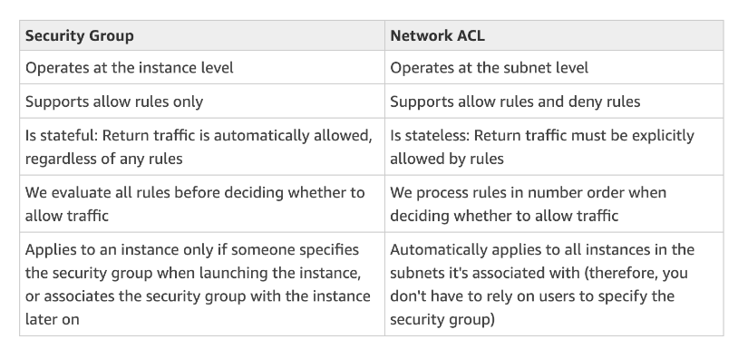

# AWS Certified Cloud Practitioner
Created 7 Aug 2020
My Notes for the [Ultimate AWS Certified Cloud Practitioner](https://www.udemy.com/course/aws-certified-cloud-practitioner-new/) by Stephane Maarek on Udemy.

# Cloud Computing
### What the Server is made up of:
* Compute: CPU 
* Memory: RAM
* Storage: Cloud or Database
* Network: Cables Routers (forwards data packets), Switch (takes a packet and sends to correct server) etc.

* Cloud computing is the **on demand delivery of resource** with **pay as you go pricing**

### Deployment Models
* Private Cloud - Used by a single organisation, Complete control (RackSpace)
* Public Cloud - Owned and operated by third party (AWS, Google Cloud) 
* Hybrid Cloud -Keep some serves on premise + control sensitive assets

### 5 Characteristics
1. On Demand Self Service - Don't need human Interaction
2. Broad Network Access
3. Multi-tenancy and Resource Pooling - Customers share infrastructure
4. Rapid Elasticity and Scalability - Scale based on demand
5. Measured Service - Pay for what you use

### 6 Advantages
1. Trade CapEx for OpEx
2. Benefit from Economies of Scale
3. Stop guessing capacity
4. Increase speed and agility
5. Stop spending money on data centres
6. Go global in minutes

## Types of Cloud Computing
* IaaS (EC2, GCP etc.)
	* Provides building blocks for cloud IT - need to manage OS etc.
	* Just provides computers, networks etc
	* Highest flexibility
* PaaS (Beanstalk, Heroku)
	* Removes the need to manage the infrastructure
	* Just focus on development
* SaaS (Gmail, Dropbox)
	* Completed product that is run and managed by the service provider

## Pricing
* Compute
* Storage
* Data Transfer OUT

## Locations
* Regions
	* Clusters of data centers (us-east-1 etc.)
	* Each region has at least 2 AZs
* AZ
	* Usually 3 AZs per region (us-east-1a)
	* Separate to isolate from disasters
* Edge Locations
	* To deliver content with lower latency (Netflix)

# IAM - Identity & Access Management
* Don’t use the Root Account

### Groups
* Groups only contain users not other groups
* Users can belong to multiple groups
* Groups can be assigned JSON documents called **Policies** (Permissions)
* **Least privilege principle**: Don't give more permission that necessary
* **Tag** to mark attributes - to classify and organise resources

### IAM Password Policy 
* Able to set a password policy with different security requirements
* MFA = password + security device owned
	* **Virtual MFA device** (Google authenticator, Authy)
	* **U2F Key** - YubiKey
	* **Hardware KeyFob** 

### Accessing AWS
* AWS Management Console
* AWS CLI (protected by access keys)
* AWS SDK (protected by access keys)
* Access Key = ID + Secret Access Key
* Use IAM account for access keys

### IAM Roles
* Assign permissions for AWS Services with IAM roles

### Security Tools 
* Credential Report (account Level) - lists all users + credentials
* Access Advisor (user-level) - shows service permissions granted + when last accessed

### Shared Responsibility
* AWS handles infrastructure, config, compliance validation

# EC2
* Elastic Compute Cloud -> **IaaS**

### Config Options
* Can rent either Linux or Windows
* Dependent on how much CPU + RAM + Type of Network etc.

### Hands-On
* Stopping and starting instances may change Public IP

### Security Groups
* Control how traffic is allowed in or out of EC2 Instances
* Security Groups **only contain allow rule** (Firewalls)
* 22 = SSH - log into a linux instance
* 21 = FTP (File Transport Protocol)
* 80 = HTTP - Access unsecured web
* 443 = HTTPS - access secured web
* 3389 - log into a Windows Instance

### EC2 SSHing
* Put key in directory
`ssh -i FileName.pem ec2-user@ip address`
`Error 0644` - bad permission
`chmod 0400 keyname`
* Never run AWS Configure on an EC2 instance because other users can get your key + personal information
* Attach roles by right clicking instance, attach/replace IAM Role

### Purchasing Options
* **On Demand:** Short workload, predictable pricing
	* Linux - **billing per second**
	* Windows - **billing per hour**
	* Highest cost but no upfront payments
* **Reserved:** Minimum 1 year period
	* Up to 75% discounts: 1 year or 3 year
	* Reservation period: 1 year = + discount | 3 years = +++ discount
	* Purchasing options: No upfront | partial upfront = + | All upfront = ++ discount
	* **Convertible:** Long workloads with flexible instances (ie. can change to another type)
		* Up to 45% Discount
	* **Scheduled:** Every fixed time
		* Commitment for 1 year
* **Spot Instances** - Short workload, cheap but **can lose instances** (less reliable)
	* Discount up to 90%
* **Dedicated Hosts:** Book Entire server, control instance placement
	* 3 year period reservation
	* For strong regulatory needs
* **Dedicated Instances:** No other customer will share hardware
	* No control over instance placement

### Shared Responsibility
* User has to do security groups OS patches and updates and managed software installed

# EBS - Elastic Block Store
* **Hard-drive to attach to instances** - USB Network stick
* Allows instances to persist, even after termination
* Can be mounted to **one instance** at a time
* **Bound to a specific AZ**
* 2 EBS can be attached to 1 instance - attach to the same area
* Only root EBS is terminated when instance is shut down

### EBS Snapshot
* Snapshot is backup at any point of time
* Recommended to detach volume
* Can copy snapshot across AZ
* **EBS Volumes allows instances’ data to persist even after their termination**. EC2 Instance stores do not keep data after termination.

## AMI - Amazon Machine Image
* Customisation of EC2 Instance 
	* Add your own software, OS etc. - prepackaged software
* Built for a particular region
* Launch EC2 Instances
	* Public AMI: AWS provided
	* Own AMI
	* AWS Marketplace

## EC2 Instance Store
* EBS volumes are network drives with good but limited performance
* EC2 Instance Store allows for **high performance disks**
* **Temporary** Block - Level storage for EC2 Instances (ie. cache)

## EFS - Elastic File Storage
* Managed NFS that can be **mounted on multiple EC2**
* Only works with linux EC2 instance over multi AZ

# ELB & ASG - Load Balancer + Scaling Group
* Scale -  Handle greater loads by adapting changing hardware
* Elasticity - There will be auto scaling to handle load
* Vertical scale - **Increasing the size** of instance (t2.micro to t2.large)
	* Common for no distributed system like db
	* Hardware limit for scalability
* Horizontal scale - Increase the **number of instances**
	* Need distributed system common for web applications 
	* Easy to scale with ASG 
* High availability - Running app in at least 2 AZs
	* ASG Multi AZ
	* LB Multi AZ

## Loadbalancers
* Servers that forward internet traffic to multiple EC2 Instances
* Spread load to multiple instances
* Handle downstream failures
* Provide SSL termination for website

## ELB 
* Distribute traffic across backend EC2 instances, can be Multi-AZ
* AWS guarantees that it will be working, takes care of upgrades, provides config knobs
* 3 Types of LBs
	* Application Load Balancer - Layer 7
	* Network Load Balancer - Layer 4
	* Classic Load Balancer - Layer 4 & 7
* Load balancer to keep the same ip for 2 server instances

## Auto Scaling Group
* Implement Elasticity for your application, across multiple AZ
* Load of websites can change - more load during the day
* **Scale out to match increase load**
* Ensure we have minimum & maximum number of machines running
* Automatically register new instances 
* Replace unhealthy instances 
* Cost Savings

# Storage
## S3
* Infinitely scaling storage for objects
* EBS snapshots stored in S3
* Backup and storage, disaster recovery archive, hybrid cloud storage, application and media hosting
* **Allows people to store objects (Files) in Buckets (directories)**
* ::Buckets must be globally unique across all accounts::
* **Buckets have to be defined in the region**
* ::No uppercase underscore:: 
* Objects have a key which is the Full Path
* **Max Object size is 5TB**
* Need to split into multiple parts if larger

### S3 Security
* User based - Attach IAM policies to allow for API Calls
* Resource Based - Bucket policies 
	- Object Acces Control List - Finer grain
	- Bucket ACL - More Common
* Access if either IAM permission allow it OR resource policy allow it 
* **No explicit deny**
* Encryption using encryption keys

### Hands On
* Principal `*` - allow everyone 
* Add a `/*` to allow all the file paths in an ARN
* To host static URL
    * Website URL will be `<bucket-name>.s3-website-<AWS-region>.amazonaws.com`
    * 403 error means bucket needs to be public
    * Need to tell bucket is a website by going into properties static website hosting

### Versioning
* Version the files
* Enabled at the bucket level 
* Same key will increment the version
* Suspending versioning will not delete previous versions
* Shift refresh to hard refresh

### S3 Access logs
* Log all requests into another S3 bucket
* Takes about 2hrs to update the access logs

### S3 replication
* Cross Region Replication
* Same Region Replication
* Buckets can be in different accounts
* Async copying behind the scene
* MUST Enable versioning in source and destination
* Must give proper IAM permissions to S3

## S3 Storage classes
* Standard - General Purpose
	* 99% Available
	* Used for rapid frequently accessed data
	* Can sustain 2 concurrent facility failure
	* For big data analytics, gaming
* Standard - Infrequent Access
	* Less frequent access but need rapid access
	* 99.9% available
	* Lower cost to standard
	* Can sustain 2 concurrent facility failure
	* For backups
* One Zone - IA
	* Same as IA but stored in one AZ
	* 99.5% availability
	* Low latency and lower cost
	* Secondary backups
* Intelligent Tiering
	* 99.9% available
	* Same low latency
	* Cost optimised by auto moving across Access tiers
	
### S3 Glacier
* **Low cost object storage for archiving backup**
* Takes time + **fees for data retrieval**
* Bulk 5-12 hours to access files
	
### Deep Archive 
* Cheaper and takes the longest time to access
* Standard - 12hours
* Bulk - 48hours

### Snowball
* Physical data transport
* Pay per data transfer job
* Takes more than a week

### Snowball Edge
* Adds computational capability
* Supports EC2 AMI to process + Lambda functions

### Snowmobile
* Transfer Exabytes of data 

### Storage Gateway 
* Hybrid bridge between on premise data and cloud data in S3

# Database & Analytics (RDS, Aurora, Elasticache, DynamoDB, Redshift, EMR, Athena, DMS, Glue)
* Able to structure the data and build indexes to query and search through the data 
* Define relationships between datasets

### Relational Database
* Like Excel with links
* Can use SQL to perform lookups
* Vertical scaling

### NoSQL Database
* **Non relational** database for specific data models
* More flexible to evolve
* Designed to scale out with horizontal
* High performance & high functional
* Example: JSON 

### RDS - Relational Database Service
* OLTP
* **Uses SQL**
* Continuous backups + point in time restore
* Monitor dashboard
* Scaling capability
* But cannot SSH into instance

### Aurora 
* Relational (OLTP)
* PostgreSQL & MySQL both supported
* **AWS cloud optimised with 5x performance over RDS**
* More expensive than RDS (20%)
* Storage grows in increments of 10GB up to 64TB

### Neptune
* Managed Graph DB

### ElastiCache
* For Redis or Memcached
* In-memory DB with high performance, low latency
* **For fast read / write from cache**
* AWS takes care of OS maintenance / patching etc.

### DynamoDB
* Highly available over 3AZs
* Non-Relational DB
* Millions of requests per second for 100s of TB storage
* Single ms latency
* Low cost with Auto Scaling Capabilities
* **No SQL Key Value DB**

### DocumentDB
* NoSQL Document DB that is also MongoDB compatible

### Redshift
* Reads by columns rather than rows
* Petabytes worth of data
* Based on PostgreSQL, not for OLTP - online transaction
* **For Online Analytical Processing (OLAP)**
* Loads data every hour
* 10x better performance compared to other data warehouse
* Pay as you go 

### EMR - Elastic MapReduce
* For creating Hadoop clusters (Big Data) to analyse and process data
* Clusters of 100s of EC2 Instances
* Takes care of all the provisioning and config
* **For data processing, machine learning, web indexing etc.**

### Athena
* Fully server-less with SQL capabilities
* **Used to query data in S3**
* Pay per query
* Secured through IAM

### DMS - DB Migration Service
* To migrate DB to AWS
* Source DB remains available during migration

### Glue
* Managed extract, transform and load service
* Used to prepare and transform data for analytics
* Fully server-less

# Compute
* Docker is a platform to deploy apps in many OSes
* Docker images are stored in Docker repos
* Docker helps to use less resources than VM

### ECS - Elastic container service 
* Used to **launch docker containers** on AWS
* User must provision and maintain the EC2 Instances
* AWS takes care of starting and storing containers
* able to integrate with ALB

### FarGate
* Launch Docker containers on AWS
* No need to provision the infra - no EC2 instances to manage
* **Server-less offering**
* Just runs based on the CPU RAM

### EKS 
* To deploy apps using Kubernetes

### ECR - elastic container registry
* Private docker registry
* Place to store docker images to run ECS or FarGate

### Serverless
* **Devs don't manage servers** - they just deploy code or functions
* There are servers behind the scenes though
* ::S3 DynamoDB FarGate Lambda::

### Lambda
* **Run code without managing servers**, only pay for the compute time
* EC2 has virtual serves which are limited by RAM and CPU / continuously running
* Lambda are virtual functions which are limited by time - short executions / run on demand
* Pay per request and compute time
* Integrated with many programming languages
* Example: Creating a thumbnail - not continuous
* First 1M requests free
* 400Gbs of compute time per month free
* Server-less CRON jobs

### AWS Batch
* Batch job has a start and an end
* Defined as docker images and runs on ECS
* No time limit unlike lambda
* Relies on EC2 (so not server-less)

### Lightsail
* Virtual servers, storage etc.
* For people with little cloud exp
* For simple web apps, websites
* No Auto Scaling

# Deploying and Managing Infrastructure at Scale
* Allocation or creation of resources and services

### Cloudformation (Free)
* IaaS
* **Declarative way of outlining AWS infrastructure using JSON or YAML**
* Templates creates config of required AWS services
* Able to destroy and recreate infrastructure on the cloud easily
* Can see diagram of required services on Stack Designer

### QuickStart
* Pre-made packages to launch and configure AWS Cloudformation

### Beanstalk (Free)
* Developer centric view of **deploying apps** - like Heroku
* Just choose container and language
* Various AWS services in one view
* Is a PaaS (full control over config)
* Instance config and OS handled by Beanstalk

### AWS CodeDeploy
* To Deploy apps automatically
* Works with EC2 / **hybrid servers**
* Must provision and config servers ahead of time with agent

### AWS Systems Manager (SSM)
* Helps to manage EC2 and on premises systems at scale
* **Hybrid** service
* **Get operational insights**
* Patching automation for compliance
* Run commands across servers

### SWS OpsWorks
* **Chef & Puppet** to help perform server config automatically
* Alternative to SSM
* **Hybrid**

# Global Infrastructure
* Global app - deployed in multiple geographies
* Edge locations - for fast content delivery

###  Route 53
* To **route users to closest deployment with least latency**
* Managed DNS - collection of rules and records to help clients understand how to reach a server through URLs
* User sends DNS request to Route 53 and it sends back nearest IP

### Routing Policies (Important)
* **Simple routing policies** - no health checks
* **Weighted routing policy** - DNS will manage % of clients to instances (load balancing)
* **Latency routing policy** - look where user is located and redirect to the nearest server
* **Failover routing policy** - DNS will do health check to see if the instance has failed and connect to the healthy one

### CloudFront
* Content delivery Network (CDN)
* Content cached at the edge
* 216 Points of Presence
* **Pricing differs for each region**
	* Priced by amount of HTTP requests
* DDOS protection
* S3 Origin - enhanced security for CloudFront OAI
* HTTP Origin - custom
* Files are cached for a day
* Great for static content
* Error 307 
	* Need to wait 24hr for s3 bucket to replicate globally
	* Or add origin domain name `-ap-southeast-1`

### CloudFront vs S3 CRR
* S3 CRR must be set up in each region
* Read only
* Great for dynamic content

### S3 Transfer Accelerator
* Increase transfer speed by transferring file to edge location

### AWS Global Accelerator
* Improve availability and performance using AWS Global Network
* Optimise the route of app by 60%
* 2 Anycast IP are created to send traffic through edge locations

### GA vs CloudFront
* CloudFront improves performance of cacheable content + served at the edge
* No caching, good for static IP addresses

# Cloud Integrations (SQS, SNS)
### SQS - Simple Queue Service (Good for delaying)
* Server-less used to decouple applications
* 1-10000 messages per second
* 4-14 days retention of messages
* Messages deleted after read
* No limit to number of messages in Queue

### SNS (Notification Service) 
* Send one message to many receivers using event publishers
* Up to 10Mil Subscriptions per topic, 100k topic limit
* Subscribe through Email, Lambda etc.
* Only plain text email

# Cloud Monitoring + Logging
## CloudWatch
### CloudWatch Metrics
* Metrics for every service in AWS
* Can use to create CloudWatch dashboard
* EC2 Instance 
	* Default metrics per 5mins
	* Detailed monitoring (1min) $$
* Can create custom metrics

### CloudWatch Alarms
* **Trigger notifications for any metric**
* Alarm Actions:
	* Auto Scaling: increase or decrease EC3 instance
	* EC2 Actions: Terminate, stop etc
	* SNS: send a notification
* Billing alarm only exists in N Virginia

### Cloudwatch Logs
* Performance Data about AWS Services
* To collect logs of actions to see what the application did
* Can collect from Beanstalk, ECS, Lambda, Route53, CloudTrail etc.
* Real time monitoring of logs

### Cloudwatch Events
* Schedule CRON Jobs
* Trigger Event pattern based on Condition
* Trigger Lambda functions

### EventBridge
* Next evolution of Events
* Can receive partner Event buses from SaaS service apps 

### CloudTrail
* **Logs all API calls btw AWS services**
* Provides governance, compliance & Audit to blame people
* Enabled by default
* Get an history of events/API calls made
* Good for investigating unusual activity
* Can put logs in S3

### X-Ray
* Provides a visual analysis of apps that require many services
* What is happening in each server and where is the bottleneck

### Service Health Dashboard
* Shows the health of service in a particular region
* Can subscribe as an RSS feed

### Personal Health Dashboard
* Provides alerts and remediation guidance when AWS is experiencing events that may impact user
* Personalised view into performance and availability

# VPC & Networking
* VPC - **Virtual Private Cloud**: private network to deploy resource (regional)
* Subnets - Partition network inside VPC (within AZ)
* Public subnet - accessible from the internet
* Private subnet - not accessible
* Internet Gateway - access to the internet
* NAT Gateway (AWS Managed) NAT Instances (Self-managed) to allow instances in private subnet to access internet while remaining private

* **NACL** - Firewall that controls traffic from and to **subnet** at the subnet level
* **Can have ALLOW and DENY** rules for IP addresses
* Attached to the subnet level

* **Security Groups** - to control traffic to and from EC2 **Instance** at the instance level
* Denies ALL unless **ALLOW rules** for IP and other security groups

### VPC Flow Logs
* Capture IP traffic going into interfaces
* VPC, Subnet, ENI Flowlogs
* Helps to monitor & troubleshoot connectivity issues

### VPC Peering
* Connects 2 VPCs, privately using AWS network
* Make them behave as if same network

### VPC Endpoint
* Connect to AWS services using a private network instead of www
* Enhanced security and lower latency

### Site to Site VPN
* **Connect on premise VPN (Customer Gateway) to AWS (Virtual Private Gateway)**
* Goes over the public internet
* Auto encrypt

### Direct Connect
* Establish a physical connection btw on premise and AWS
* Goes over private network
* Takes a month to establish

### Transit Gateway
* Transitive peering btw 1000s of VPC hub and spoke connections

# Security and compliance
* AWS responsibility - security OF the cloud
* Customer responsibility - security IN the cloud (patching, configs etc.)
* Shared - Patch management, config management, awareness & trainings

### DDOS Protection
* Overwhelmed service using bots
* **Shield Standard**: protects against DDOS at no cost (common attacks)
	* Layer 3,4 & 7
	* Must be routing though CloudFront or Route 53
* **Shield Advanced**: 24/7 Premium DDOS protection with DRP team
	* $3000 per month
	* More sophisticated attacks
	* Protected against higher fees during spike usage
* **Web Application Firewall**: Filter specific requests based on rules
	* Protects against Level 7 exploits (HTTP)
	* Deploy in ALB, API Gateway and CloudFront
	* Define the web control List
	* Geomatch to block specific countries
* **CloudFront & Route 53**: availability protection using Global edge network

### Penetration Testing
* Carry out pen tests without AWS approval for 8 services
* Cannot DDOS or flood

### KMS - Key Management Service
* Manages the encryption keys
* Uses Envelope Encryption
* For some services the encryption is opt in
* **::CloudTrail Logs, Glacier and Storage Gateway have encryption enabled::**
* CloudHSM - hardware security module
	* AWS provisioned hardware
	* User manages keys entirely
* KMS Keys
	* Customer Manager (CMK) - create, manage or disable + rotation policy
	* AWS Managed CMK - used by AWS Service
	* CloudHSM - generated from CloudHSM

### Secrets Manager
* For storing secrets
* Can force rotation every X days
* Automate generation of secrets + integrate with RDs
* Secrets encrypted using KMS

### AWS Artifact - Why should org trust Amazon
* Provides users with on-demand access to **compliance docs** + AWS agreements
* Used to support internal audit + compliance

### AWS GuardDuty
* Uses **ML to protect threats from the inside**
* 30 days trial
* Looks at CloudTrail logs etc.
* Can set up CloudWatch event rules

### Amazon Inspector
* **Audits a single EC2 Instance**
* Generates a report with 699 checks
* Automated security assessments of EC2 Instances
* Analyse the running OS against known vulnerabilities
* Against unintended network access
* Cannot track config changes

### Config 
* Auditing and recording of users AWS resources
* Helps to record config data

### Macie
* Uses ML to discover and **protect sensitive PII** (Personally Identifiable Info)
* Will identify most at risk users who could lead to compromise

# Machine Learning
### Rekognition
* Find objects, people texts scenes in images and videos using ML
* Facial analysis + Facial search

### Transcribe
* Convert speech to text

### Polly
* Convert text into speech

### Translate
* Localise content such as websites by translating

### Amazon Lex
* Powers Alexa
* Auto speech recognition
* NLP to understand context
* For chatbots 

### Connect
* Receive calls, cloud based virtual contact center

### Comprehend
* For NLP to find insights and relationships in text
* Analyse customer interactions etc

### SageMaker
* Fully managed service for devs to build ML models

# Account Management, Billing & Support
## Account Management
### AWS Organisations (& IAM)
* Global service to manage multiple AWS accounts
* Able to create organisation unit for each department and apply SCP
* Every account needs an unique email
* **Consolidated billing, pricing benefits, pooling EC2 instances**
* API available to automate AWS account creation
* Restrict privileges using SCP
* Enable CloudTrail / CloudWatch on all accounts to send logs to central account

## Billing & Costing
### Pricing Models
* Pay as you go - pay for what you use
* Save when you reserve - comply with long term reservations
* Pay less by using more
* Pay less as AWS grows
* Private IP is cheaper than public IP, use same AZs 

### TCO Calc
* Estimate the costs savings when changing to cloud
* For use in executive presentations

### Simple Monthly Calc
* Replaced by AWS Pricing Calc
* Estimate the cost for architecture solution

### Cost Allocation Tags
* Use tags to track costs on a detailed level
* Tags used to organise resources

### Costs & Usage Reports
* Most comprehensive set of AWS cost and usage data 
* Provides a CSV document
* Can integrate with Athena or QuickSight

### Costs Explorer
* To visualise AWS costs and usage over time
* Monthly, hourly details
* **Forecast of up to 3 months**
* Choose an optimal savings plan

### Billing Alarms
* Metrics stored in US East 1
* For overall worldwide AWS costs
* simple alarm (no projection)

### Budgets
* Create budget and send alarms when costs exceed budgets
* Up to 5 SNS notifications per budget
* More advanced - can track RI and get alerts
* 2 budgets free, 2c per day

### Trusted Advisor
* **Analyse AWS accounts and provides recommendations**
* Holistic advisors compared to Inspector
* Full trusted advisor for biz and enterprise customers
	* Can access AWS support API
	* Set CloudWatch alarms

## Support plans
### Basic
* 24x7 access to customer service
* 7 core checks for truster adviser
* Personal health dashboard

### Developer ($29)
* Business hours email access
* Unlimited cases + 1 primary contact
* Less than 24hours for general guidance

### Business ($100)
* 24x7 phone, email and chat access
* API access
* Unlimited cases / unlimited contacts
* Access to Infrastructure Event Management for a fee
* Less than 24hours general guidance
* Production system impaired < 4hrs
* Production system down < 1hr

### Enterprise ($15000)
* Access to technical account manager
* Concierge support team
* Infrastructure Event Management
* Biz critical system down < 15mins

# Advanced Identity
### Cognito
* Identity for web & mobile app users
* Internal DB of users

### Directory Services
* Microsoft Active Directory - DB of objects: User accounts, computers, printers
* Computers controlled by a domain controller
* **AWS Managed MSFT AD** - create AD in AWS and supports MFA
* **AD Connector** - proxy to redirect AD
* **Simple AD** - AD compatible directory on AWS

### Single Sign-On (SSO)
* One login to access multiple accounts
* Integrated with AWS organisations

# AWS Architecting & Solutions
* Test systems at production scale
* Automate to make architectural experimentation easier
* Drive architectures using data
* Improve through game days - worse days
* Be scalable + have disposable resources
* Loose coupling: break into **smaller loosely coupled components** to prevent monolith failure
* Think in terms of services not servers

## 1st Pillar - Operational Excellence
* Run & monitor systems to deliver biz value
* Perform operations as code
* Annotate documentation
* Make small frequent changes
* Refine ops procedures frequently
* Anticipate and learn from failures

## 2nd Pillar -Security
* Protect info systems and assist to deliver biz value
* Strong identity foundations
* Enable traceability - enable logs
* Apply security at all layers
* Automate security best practices
* Protect data in transit
* Prepare for security events

## 3rd Pillar - Reliability
* Recover from disruptions to meet demand
* Test recovery procedures
* Automate recovery
* Scale horizontally
* Stop guessing capacity
* Manage change in automation

## 4th Pillar - Performance Efficiency
* Meet system resources and maintain efficiency as tech evolves
* Democratise advanced tech
* Go global in minutes
* Use server-less architecture

## 5th Pillar - Cost Optimisation
* Biz value at lowest price point
* Consumption mode - pay for what you use
* Use CloudWatch to measure efficiency

## AWS Professional Services
* APN Tech partners - providing hardware, connectivity & software
* APN Consulting partners - services firm to help build on AWS
* APN Training partners - help to learn AWS
* AWS Competency Program - granted to partners who have demonstrated tech proficiency
* AWS Navigate Program - help partners become better

